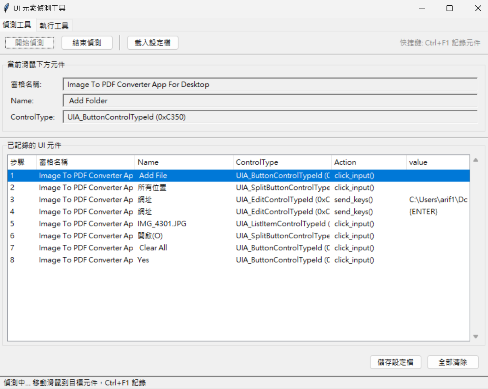
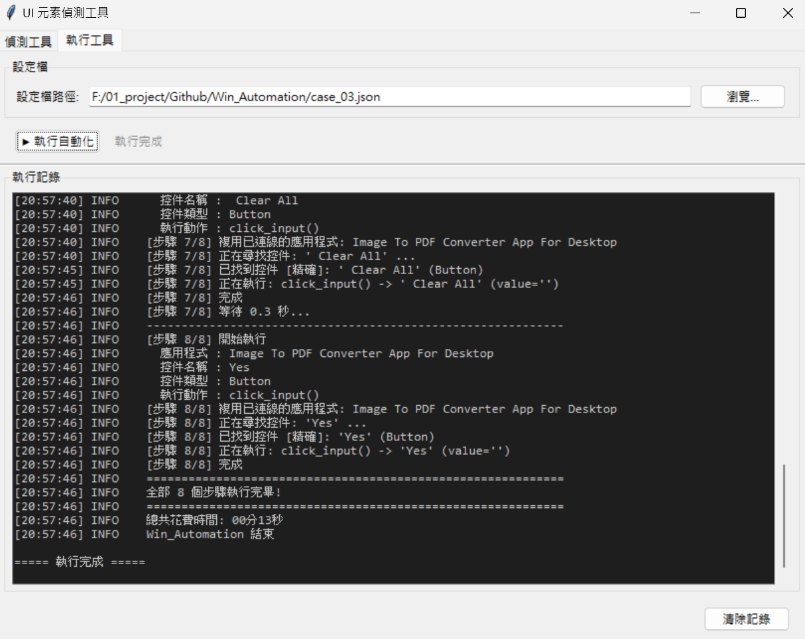

# Win_Automation

> 🤖 Windows 桌面應用 GUI 自動化框架

[](https://www.python.org/)
[](https://pywinauto.readthedocs.io/)
[](LICENSE)

---




## 📖 專案簡介

**Win_Automation** 是一套基於 Python 與 pywinauto 的 Windows 桌面應用自動化框架，專為「低程式碼」自動化設計。所有操作流程皆由 **JSON 配置檔驅動**，無需修改程式即可快速調整自動化步驟。

**主要特色**
- ✅ 流程配置驅動化（JSON），零程式碼修改
- ✅ 多應用、多控件自動化支援
- ✅ 完整 logging，執行進度與錯誤即時顯示
- ✅ 內建多層降級控件搜尋，提升穩定性
- ✅ 支援多種 UI 操作（點擊、輸入、雙擊、右鍵、鍵盤等）

---

## 🚀 快速開始

### 1. 環境準備

```bash
# 建立虛擬環境
python -m venv venv
venv\Scripts\activate

# 安裝依賴
pip install -r requirements.txt
```

### 2. 檢查和編輯自動化配置

配置檔案位於 `settings/` 資料夾，例如 `settings/case_01.json`：

```json
{
  "1": {
    "app": "GeoTag Pro",
    "Name": "folder_open 選擇照片",
    "ControlType": "UIA_TextControlTypeId (0xC364)",
    "Action": "click_input()",
    "value": "",
    "Wait": 1
  }
}
```

**配置欄位說明**
| 欄位 | 說明 |
|-----|------|
| `app` | 目標應用視窗標題 |
| `Name` | 控件名稱或顯示文字 |
| `ControlType` | 控件類型（UIA_...ControlTypeId 或 pywinauto 名稱） |
| `Action` | 執行動作（click_input、send_keys、set_text 等） |
| `value` | 輸入內容（可選） |
| `Wait` | 步驟完成後等待秒數（可選） |

### 3. 執行自動化

```bash
python run.py --case case_01.json
```

---

## 📁 專案結構

```
Win_Automation/
├── run.py                # 主自動化腳本
├── inspect_tool.py       # 控件檢查工具
├── requirements.txt      # Python 依賴列表
├── CLAUDE.md             # 詳細技術文檔（推薦閱讀）
├── README.md             # 本文件 - 快速參考
├── settings/
│   ├── case_01.json      # 自動化流程配置 (範例 1)
│   ├── case_02.json      # 自動化流程配置 (範例 2)
│   └── case_03.json      # 自動化流程配置 (範例 3)
├── doc/
│   ├── prompts.md        # 需求說明與設計理念
│   └── inspect-spec.md   # 控件檢查規範
└── img/                  # 文檔圖片
```

---

## 🛠️ 核心概念

### 控件搜尋策略

框架內建多層降級搜尋機制：
1. **精確搜尋**：title + control_type
2. **寬鬆搜尋**：只用 title（忽略類型）
3. **正則模糊**：title 正則比對（容忍空白/特殊字元差異）
4. **診斷模式**：失敗時自動列出所有可見控件協助除錯

### 支援的操作類型

| 操作 | 說明 |
|-----|------|
| `click_input()` | 左鍵點擊 |
| `double_click_input()` | 雙擊 |
| `right_click_input()` | 右鍵點擊 |
| `send_keys(keys)` | 發送鍵盤輸入 |
| `set_text(text)` | 直接設值（輸入框） |
| `type_keys(keys)` | 鍵盤輸入（同 send_keys） |

**常用鍵盤特殊鍵** (需大寫)
| 按鍵 | 寫法 |
|-----|------|
| Enter | {ENTER} |
| Tab | {TAB} |
| Escape | {ESC} |
| Delete | {DELETE} |
| Ctrl+A | ^a |
| Ctrl+C | ^c |
| Ctrl+V | ^v |

---

## 📌 常見問題排查

| 問題 | 可能原因 | 解決方案 |
|------|--------|--------|
| 無法連接應用 | 標題不符或應用未啟動 | 檢查 `app` 名稱，確保應用已開啟 |
| 找不到控件 | 名稱/類型錯誤 | 執行時檢查診斷輸出，確認控件屬性 |
| 操作無反應 | 控件未顯示或延遲不足 | 增加 `Wait` 秒數 |
| 權限錯誤 | 需要管理員權限 | 以管理員身份執行 Python |

---

## 📚 詳細文檔

- **[CLAUDE.md](CLAUDE.md)** ⭐ 完整技術文檔，包含最佳實踐和進階用法
- **[doc/prompts.md](doc/prompts.md)** - 設計理念與需求說明
- **[官方 pywinauto 文檔](https://pywinauto.readthedocs.io/)**
- **[Windows UI Automation](https://learn.microsoft.com/windows/win32/winauto/uiauto-intro)**

---

## 🐛 調試與排查

使用 `inspect_tool.py` 檢查應用中的可用控件：

```bash
python inspect_tool.py
```

---

## 🤝 貢獻與維護

1. 測試新自動化流程，複製/調整 JSON 配置檔
2. 如需擴充新操作，於 `run.py` 增加對應 Action 處理
3. 更新文檔保持內容與專案同步

---

## 📝 授權

MIT License - 詳見 [LICENSE](LICENSE)

---

**Made with ❤️ for Windows automation enthusiasts**